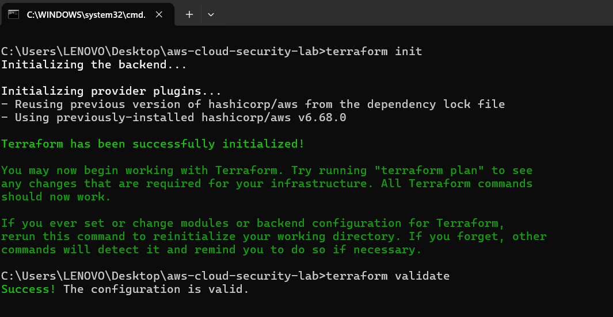
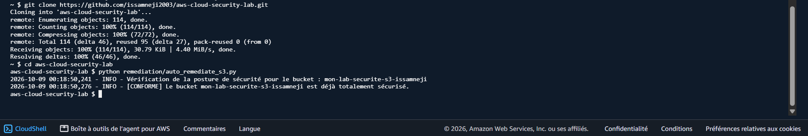

# 🧪 Rapport de Preuves — Test Evidence

Ce document répertorie l'ensemble des validations et des tests de conformité réalisés sur l'infrastructure de sécurité AWS.

---

## 1. Validation de l'Infrastructure as Code (Terraform)
* **Objectif :** Valider la syntaxe, l'intégrité et la structure des fichiers Terraform avant le déploiement.
* **Commandes exécutées :**
  ```bash
  terraform init
  terraform validate
  * **Capture d'écran de validation :**

## 2. Test du Script d'Auto-Remédiation (Runtime & SOC)
* **Environnement d'exécution :** AWS CloudShell (`eu-north-1`)
python remediation/auto_remediate_s3.py
* **Capture d'écran du résultat :**
  
  * **Résultat :** Le script identifie correctement le bucket cible et confirme sa conformité.
### Étape 3: Matrice récapitulative des tests de sécurité
| Élément testé | Type de test | Outil / Méthode | Statut |
| :--- | :--- | :--- | :--- |
| **Code Terraform** | Statique | `terraform validate` | ✅ Réussi |
| **Sécurité S3 (Chiffrement/Blocage)** | Statique & Dynamique | Checkov / Script Python | ✅ Conforme |
| **Posture IMDSv2 (EC2)** | Statique (IaC) | Revue de code HCL | ✅ Conforme |
| **Contrôle Réseau (Security Groups)** | Statique (IaC) | Revue de code HCL | ✅ Conforme |

[def]: assets/terraform-validate-success.png